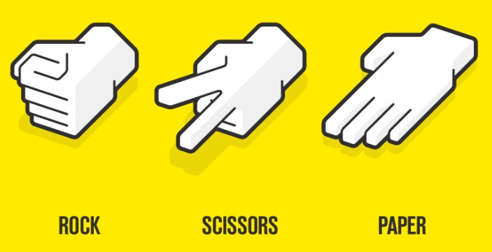
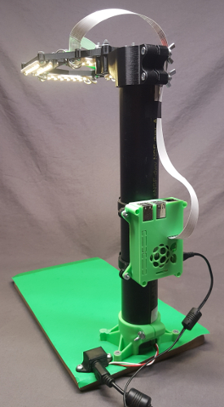
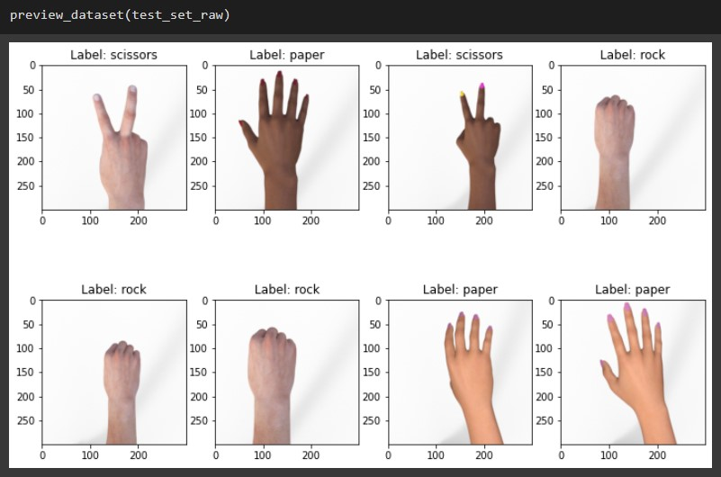
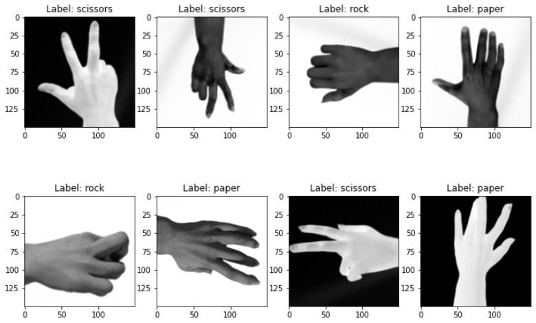
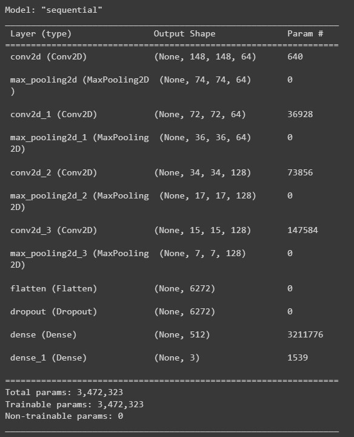
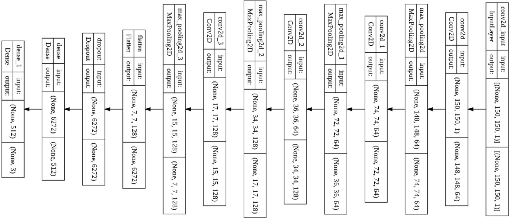

# CASA0018 – Deep Learning for Sensor Networks Report

Rock Paper Scissors Gesture Recognition on Raspberry Pi

GitHub Repo: https://github.com/virgolibra/CASA0018-Assessment

Minghao ZHANG

Apr 2022

## Introduction

The project is a simple gesture recognition project to identify rock, paper and scissors in real time by using Raspberry Pi and the camera. The project is based on the experiments with deep learning, simple image processing and image classification. When I considered my project topic, I was playing the classic game - rock, scissors and paper with my friend. The winner can have the last slice of pizza as a reward. It is my first time learning about deep learning and I am interested in image processing and computer vision. Therefore I decide to combine both in my project.

*Figure 1 Rock, scissors and paper [1]*

Julien's project is a complicated rock, scissors and paper game system, which contains a 3D printed holder with LED strips to ensure stable lightning and camera position to obtain consistent images. The project also contains a play mode with graphical user interface, that the user can play game with the computer AI.

Julien's project Repo: https://github.com/DrGFreeman/rps-cv

*Figure 2 Julien's project hardware*

The above example shows the possibility of my project. The objectives of my simple project is below:

+ Determine the data source (Dataset / Collected)
+ Data Pre-processing
+ Build model
+ Train model
+ Test model
+ Identify gesture from an image
+ Implement on Raspberry Pi

All project files, documents, models and my Google colab notebook are in my project [GitHub repo](https://github.com/DrGFreeman/rps-cv). 

## Research Question

How to recognise three different gestures (rock, paper and scissors) based on deep learning and image classification with Raspberry Pi and camera.

## Data

The data source is from Tensorflow dataset, called rock_paper_scissors. The dataset contains 2892 images with resolution 300*300 in RGB colour space and three different labels. 

Dataset Link: https://www.tensorflow.org/datasets/catalog/rock_paper_scissors

The model evaluation happens during training is called validation and after training is called testing. A typical split ration for train, valid and test set is 60%, 20% and 20% [2].

The default category for source is 372 images for test and 2520 for train. In this project, I split it into three sets as below:

+ Train set: 2142 images
+ Valid set: 372 images
+ Test set: 378 images

The ratio is about 75%, 12.5%, 12.5%.

*Figure 3 Preview dataset images*

The above figure shows randomly selected images as a preview. The hands are in the same direction. A series of transform are implemented to simulate the captured images in real world.

+ Resize 300x300 images to 150x150
+ Colour transform, including brightness, hue, saturation, contrast and inversion.
+ Image rotation, flip, zoom.
+ Random function is applied to ensure randomly transform.
+ Convert RGB colour space to grayscale.
+ Shuffling the data to ensure the model not to learn something from the order
+ The data batching is to split the set to speed up the training procedure.

*Figure 4 Preview dataset images after transformation*

Train, validation and test sets are all implemented the above transformation. Now the hands are in different directions with various scale, as Figure 4 shown. The source data is ready for training.

## Model

Convolutional Neural Network (CNN) provides feature maps from input features based on shared-weight architecture, which has multiple applications in image and video recognition, image classification and image segmentation [3]. Therefore, the model is based on CNN architecture with four convolution layers and three output units, which indicate to three gestures. Figure 5 and Figure 6 are the model architecture.

*Figure 5 Model Summary*

*Figure 6 Model Flowchart*

## Experiments

What experiments did you run to test your project? What parameters did you change? How did you measure performance? Did you write any scripts to evaluate performance? Did you use any tools to evaluate performance? Do you have graphs of results? 

*probably ~300 words and graphs and tables are usually good to convey your results!*

## Results and Observations

Synthesis the main results and observations you made from building the project. Did it work perfectly? Why not? What worked and what didn't? Why? What would you do next if you had more time?  

*probably ~300 words and remember images and diagrams bring results to life!*

## Bibliography

*If you added any references then add them in here using this format:*

1. Acharya, M. (2020). Building a Rock Paper Scissors AI using Tensorflow and OpenCV with Python. https://towardsdatascience.com/building-a-rock-paper-scissors-ai-using-tensorflow-and-opencv-d5fc44fc8222
1. Warden, P. & Situnayake, D. (2019) *TinyML / Warden, Pete.* 1st edition. O’Reilly Media, Inc.
1. Mouton, C., Myburgh, J.C., Davel, M.H. (2020). Stride and Translation Invariance in CNNs. In: Gerber, A. (eds) Artificial Intelligence Research. SACAIR 2021. Communications in Computer and Information Science, vol 1342. Springer, Cham. https://doi.org/10.1007/978-3-030-66151-9_17
2. Last name, First initial. (Year published). Title. Edition. (Only include the edition if it is not the first edition) City published: Publisher, Page(s). http://google.com

----

## Declaration of Authorship

I, AUTHORS NAME HERE, confirm that the work presented in this assessment is my own. Where information has been derived from other sources, I confirm that this has been indicated in the work.

Minghao ZHANG

22 Apr 2022