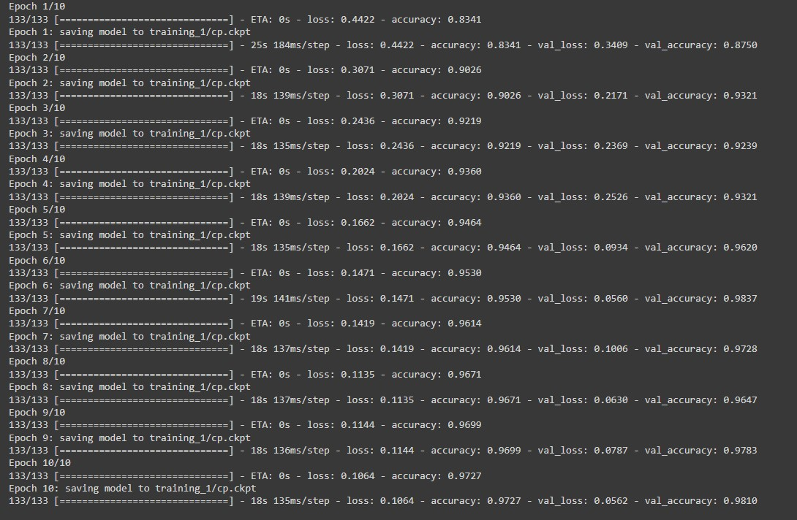

# CASA0018 – Deep Learning for Sensor Networks Report

Rock Paper Scissors Gesture Recognition on Raspberry Pi

GitHub Repo: https://github.com/virgolibra/CASA0018-Assessment

Minghao ZHANG

Apr 2022

## Introduction

The project is a simple gesture recognition project to identify rock, paper and scissors in real time by using Raspberry Pi and the camera. The project is based on the experiments with deep learning, simple image processing and image classification. When I considered my project topic, I was playing the classic game - rock, scissors and paper with my friend. The winner can have the last slice of pizza as a reward. It is my first time learning about deep learning and I am interested in image processing and computer vision. Therefore I decide to combine both in my project.


*Figure 1 Rock, scissors and paper [1].*

Julien's project is a complicated rock, scissors and paper game system, which contains a 3D printed holder with LED strips to ensure stable lightning and camera position to obtain consistent images. The project also contains a play mode with graphical user interface, that the user can play game with the computer AI.

Julien's project Repo: https://github.com/DrGFreeman/rps-cv


*Figure 2 Julien's project hardware.*

The above example shows the possibility of my project. The objectives of my simple project is below:

+ Determine the data source (Dataset / Collected)
+ Data Pre-processing
+ Build model
+ Train model
+ Test model
+ Identify gesture from an image
+ Implement on Raspberry Pi


All project files, documents, models and my Google colab notebook are in my project [GitHub repo](https://github.com/DrGFreeman/rps-cv). 


## Research Question

How to recognise three different gestures (rock, paper and scissors) based on deep learning and image classification with Raspberry Pi and camera.


## Data

The data source is from Tensorflow dataset, called rock_paper_scissors. The dataset contains 2892 images with resolution 300*300 in RGB colour space and three different labels. 

Dataset Link: https://www.tensorflow.org/datasets/catalog/rock_paper_scissors

The model evaluation happens during training is called validation and after training is called testing. A typical split ration for train, valid and test set is 60%, 20% and 20% [2].

The default category for source is 372 images for test and 2520 for train. In this project, I split it into three sets as below:

+ Train set: 2142 images
+ Valid set: 372 images
+ Test set: 378 images

The ratio is about 75%, 12.5%, 12.5%.


*Figure 3 Preview dataset images*.

The above figure shows randomly selected images as a preview. The hands are in the same direction. A series of transform are implemented to simulate the captured images in real world.

+ Resize 300x300 images to 150x150
+ Colour transform, including brightness, hue, saturation, contrast and inversion.
+ Image rotation, flip, zoom.
+ Random function is applied to ensure randomly transform.
+ Convert RGB colour space to grayscale.
+ Shuffling the data to ensure the model not to learn something from the order


*Figure 4 Preview dataset images after transformation.*

Train, validation and test sets are all implemented the above transformation. Now the hands are in different directions with various scale, as Figure 4 shown. The source data is ready for training.


## Model

Convolutional Neural Network (CNN) provides feature maps from input features based on shared-weight architecture, which has multiple applications in image and video recognition, image classification and image segmentation [3]. Therefore, the model is based on CNN architecture with four convolution layers and three output units, which indicate to three gestures. Figure 5 and Figure 6 are the model architecture.


*Figure 5 Model Summary.*


*Figure 6 Model Flowchart*.


## Experiments

The data batching is to split the set to speed up the training procedure. The different batch sizes are tested.

+ For batch size 32, the steps per epoch equal to 66, and the validation steps equal to 11.
+ For batch size 16, the steps per epoch equal to 133, and the validation steps equal to 23.

In addition, the performance of 10 epochs and 15 epochs are tested.

```python
training_history = model.fit(
    x=train_set_shuffled.repeat(),
    validation_data=valid_set_shuffled.repeat(),
    epochs=10,
    steps_per_epoch=steps_per_epoch,
    validation_steps=validation_steps,
    callbacks=[
        cp_callback,
    ],
    verbose=1
)
```


 

*Figure 7 Train progress (batch size = 32, epoch = 10).*



*Figure 8 Train progress (batch size = 16, epoch = 10).*


*Figure 9 Train progress (batch size = 32, epoch = 15)*.

Figures above show the training progress, which contain the training loss, training accuracy, validation loss and validation accuracy of each epoch. In addition, relevant training results are plotted to get graphs.

```python
def render_training_history(training_history):
    loss = training_history.history['loss']
    val_loss = training_history.history['val_loss']

    accuracy = training_history.history['accuracy']
    val_accuracy = training_history.history['val_accuracy']

    plt.figure(figsize=(15, 5))

    plt.subplot(1, 2, 1)
    plt.title('Loss')
    plt.xlabel('Epoch')
    plt.ylabel('Loss')
    plt.plot(loss, label='Training set')
    plt.plot(val_loss, label='Validation set', linestyle='--')
    plt.legend()
    plt.grid(linestyle='--', linewidth=1, alpha=0.5)

    plt.subplot(1, 2, 2)
    plt.title('Accuracy')
    plt.xlabel('Epoch')
    plt.ylabel('Accuracy')
    plt.plot(accuracy, label='Training set')
    plt.plot(val_accuracy, label='Validation set', linestyle='--')
    plt.legend()
    plt.grid(linestyle='--', linewidth=1, alpha=0.5)

    plt.show()
```


After training, the model is tested by the pre-split test set (15%). Some photos are captured and uploaded to test the performance.


*Figure 10 Upload captured image to test the model.*


*Figure 11 Captured images for model test.*

To implement on Raspberry Pi, a 5 megapixels 1080p webcam OV5647 sensor is used to capture. The model is trained and saved based on the colab notebook and then loaded on Raspberry Pi for real-time image classification. 


*Figure 12 Raspberry Pi and the camera.*


## Results and Observations

 

*Figure 13 Train history graph (batch size = 32, epoch = 10).*


*Figure 14 Train history graph (batch size = 16, epoch = 10).*


*Figure 15 Train history graph (batch size = 32, epoch = 15)*.

 

*Figure 16 Test result (batch size = 32, epoch = 10).*


*Figure 17 Test result (batch size = 16, epoch = 10).*


*Figure 18 Test result (batch size = 32, epoch = 15)*.

+ **Training observations:** The training loss is greater than the validation loss. Training accuracy is less than the validation accuracy. A smaller batch size leads to a faster convergence at the beginning of the training.

+ **Test observations:** The train and validation accuracy of epoch 15 is better than 10, but the performance of test set is not good, which is probably because of overfitting. The smaller batch size seems not affect to the accuracy and the loss with the same epoch, but increases the time cost of training. After comparing with different parameters, batch size 16 and 10 epochs are chosen for the model.
+ **Limitations:** The background of the dataset images is white. But the background of real-time video streaming is not always white, which can affect the accuracy. After implementing on Raspberry Pi, the stream fps is too low, which is about 4 frames per second. Also, the accuracy is not high enough for real-time recognition.
+ **Improvements:** Currently the dataset is directly from TensorFlow dataset. It could be better if the dataset is based on the various hand images that are captured in the real situation with various background. Further experiments in the relevant parameters, such as the batch size, number of epochs and different layer structures are also need to find a better solution for the model performance.
+ **Challenges:** The biggest challenge is to setup running environments on Raspberry Pi, such as setup OpenCV and TensorFlow environments. In addition, according to the given feedback, I tested the implementation of the TensorFlow Lite model. It was successful to generate a TensorFlow Lite model, but I cannot implement the model on Raspberry Pi based on the graphical user interface, which means I cannot test the performance.
+ **Future work:** Successfully implement the TensorFlow Lite model is priority. Also, some components such as LCD screen and LEDs can be connected to Pi GPIO pins to represent the identification of rock, paper and scissors. As a kind of gesture recognition, it is possible to implement the gesture recognition to control some devices. For example, the light can be turned on by showing a paper, and be turned off by a rock.


## Bibliography

1. Acharya, M. (2020). Building a Rock Paper Scissors AI using Tensorflow and OpenCV with Python. https://towardsdatascience.com/building-a-rock-paper-scissors-ai-using-tensorflow-and-opencv-d5fc44fc8222
2. Warden, P. & Situnayake, D. (2019) *TinyML / Warden, Pete.* 1st edition. O’Reilly Media, Inc.
3. Mouton, C., Myburgh, J.C., Davel, M.H. (2020). Stride and Translation Invariance in CNNs. In: Gerber, A. (eds) Artificial Intelligence Research. SACAIR 2021. Communications in Computer and Information Science, vol 1342. Springer, Cham. https://doi.org/10.1007/978-3-030-66151-9_17


----

## Declaration of Authorship

I, Minghao ZHANG, confirm that the work presented in this assessment is my own. Where information has been derived from other sources, I confirm that this has been indicated in the work.


Minghao ZHANG

22 Apr 2022